# 온누리 전자제품 쇼핑몰 - 시스템 시퀀스 다이어그램

> **Spring Boot 기반 B2B/B2C 통합 전자상거래 플랫폼의 시스템 아키텍처 및 컴포넌트 간 상호작용**

---

## 📋 목차

1. [시스템 개요](#1-시스템-개요)
2. [핵심 컴포넌트 아키텍처](#2-핵심-컴포넌트-아키텍처)
3. [사용자 인증 및 JWT 토큰 관리 시퀀스](#3-사용자-인증-및-jwt-토큰-관리-시퀀스)
4. [복합 결제 시스템 시퀀스](#4-복합-결제-시스템-시퀀스)
5. [상품 주문 및 장바구니 관리 시퀀스](#5-상품-주문-및-장바구니-관리-시퀀스)
6. [Spring Batch 자동화 처리 시퀀스](#6-spring-batch-자동화-처리-시퀀스)
7. [상품 검색 및 카테고리 관리 시퀀스](#7-상품-검색-및-카테고리-관리-시퀀스)
8. [관리자 시스템 운영 시퀀스](#8-관리자-시스템-운영-시퀀스)
9. [CI/CD 배포 파이프라인 시퀀스](#9-cicd-배포-파이프라인-시퀀스)

---

## 1. 시스템 개요

```mermaid
graph TB
    subgraph "클라이언트 레이어"
        WEB[웹 브라우저]
        MOBILE[모바일 앱]
        ADMIN[관리자 웹]
    end

    subgraph "API Gateway & 보안"
        SECURITY[Spring Security]
        JWT[JWT Provider]
        FILTER[JWT Authentication Filter]
    end

    subgraph "애플리케이션 레이어"
        CONTROLLER[Controllers]
        SERVICE[Services]
        BATCH[Spring Batch]
        SCHEDULER[Scheduler]
    end

    subgraph "데이터 접근 레이어"
        JPA[JPA/Hibernate]
        QUERYDSL[QueryDSL]
        MYBATIS[MyBatis]
    end

    subgraph "외부 서비스"
        PG1[온누리 PG]
        PG2[EasyPay PG]
        EMAIL[Email Service]
    end

    subgraph "인프라 레이어"
        MASTER[(Master DB)]
        SLAVE[(Slave DB)]
        REDIS[(Redis Cache)]
        FILES[File Storage]
    end

    WEB --> SECURITY
    MOBILE --> SECURITY
    ADMIN --> SECURITY

    SECURITY --> FILTER
    FILTER --> JWT
    JWT --> CONTROLLER

    CONTROLLER --> SERVICE
    SERVICE --> JPA
    SERVICE --> QUERYDSL
    SERVICE --> MYBATIS

    SERVICE --> PG1
    SERVICE --> PG2
    SERVICE --> EMAIL

    JPA --> MASTER
    QUERYDSL --> MASTER
    MYBATIS --> SLAVE

    SERVICE --> REDIS
    SERVICE --> FILES

    SCHEDULER --> BATCH
    BATCH --> SERVICE
```

**시스템 특징:**

- **확장 가능한 3-Tier 아키텍처**: 프레젠테이션, 비즈니스, 데이터 레이어 분리
- **Master-Slave DB 구성**: 읽기/쓰기 분산으로 성능 최적화
- **Redis 기반 세션 관리**: 분산 환경에서의 세션 무결성 보장
- **Spring Batch 자동화**: 대용량 데이터 처리 및 스케줄링

---

## 2. 핵심 컴포넌트 아키텍처

```mermaid
graph LR
    subgraph "프레젠테이션 레이어"
        MC[Member Controller]
        PC[Product Controller]
        CC[Cart Controller]
        PAC[Payment Controller]
        AC[Admin Controller]
    end

    subgraph "비즈니스 로직 레이어"
        MS[Member Service]
        PS[Product Service]
        CS[Cart Service]
        PAS[Payment Service]
        CPS[Compound Pay Service]
        AS[Admin Service]
    end

    subgraph "데이터 접근 레이어"
        MQD[Member Query Data]
        PQD[Product Query Data]
        CQD[Cart Query Data]
        PAQD[Payment Query Data]
        AQD[Admin Query Data]
    end

    subgraph "보안 & 인증"
        JTP[JWT Token Provider]
        SEC[Security Config]
        AUTH[Authentication Filter]
    end

    subgraph "배치 & 스케줄링"
        BC[Batch Config]
        SC[Scheduler Config]
        AC_ASYNC[Async Config]
    end

    MC --> MS
    PC --> PS
    CC --> CS
    PAC --> PAS
    PAC --> CPS
    AC --> AS

    MS --> MQD
    PS --> PQD
    CS --> CQD
    PAS --> PAQD
    CPS --> PAQD
    AS --> AQD

    MS --> JTP
    PS --> JTP
    CS --> JTP
    PAS --> JTP

    JTP --> SEC
    SEC --> AUTH

    SC --> BC
    BC --> PS
    BC --> AS
```

---

## 3. 사용자 인증 및 JWT 토큰 관리 시퀀스

### 3.1 일반 회원(B2C) 로그인 시퀀스


### 3.2 JWT 토큰 검증 및 인증 시퀀스

```mermaid
sequenceDiagram
    participant Client as 클라이언트
    participant Filter as JwtAuthenticationFilter
    participant JWT as JwtTokenProvider
    participant Security as SecurityContext
    participant Controller as API Controller
    participant Service as Business Service

    Client->>Filter: HTTP Request + Authorization Header
    Note over Client,Filter: Bearer JWT_TOKEN

    Filter->>Filter: resolveToken(request)
    Filter->>JWT: validateToken(token)
    JWT->>JWT: 토큰 만료시간/서명 검증
    JWT-->>Filter: 검증 결과

    alt 토큰 유효
        Filter->>JWT: getAuthentication(token)
        JWT->>JWT: parseClaims(token)
        JWT->>JWT: 권한 정보 추출
        JWT-->>Filter: Authentication Object

        Filter->>Security: setAuthentication(authentication)
        Filter->>Controller: 요청 전달

        Controller->>Service: 비즈니스 로직 호출
        Service->>JWT: getMemberFromAuthentication()
        JWT->>Security: getContext().getAuthentication()
        Security-->>JWT: Authentication
        JWT->>JWT: Member 정보 추출
        JWT-->>Service: Member Entity

        Service-->>Controller: 처리 결과
        Controller-->>Client: 200 OK + Response Data
    else 토큰 무효
        Filter-->>Client: 401 Unauthorized
    end
```

---

## 4. 복합 결제 시스템 시퀀스

### 4.1 온누리상품권 + 신용카드 복합 결제 시퀀스

```mermaid
sequenceDiagram
    participant Client as 클라이언트
    participant Controller as PaymentController
    participant Service as CompoundPayService
    participant Redis as Redis Cache
    participant OnnuryPG as 온누리 PG
    participant EasyPG as EasyPay PG
    participant DB as Master DB
    participant CartService as CartService

    Client->>Controller: POST /api/payment/compound-approval
    Note over Client,Controller: NewPaymentRequestDto + ProductList

    Controller->>Service: approval(request, dto, productList)
    Service->>Service: JWT 토큰 정합성 검증

    %% 온누리상품권 결제 처리
    Service->>Redis: get(orderNumber)
    Note over Service,Redis: 온누리 결제 정보 조회
    Redis-->>Service: OnnuryPaymentApprovalInfo

    Service->>Service: 온누리 요청 데이터 구성
    Service->>Service: bizPointCodecService.encrypt(data)
    Service->>OnnuryPG: POST /api_v1_payment_approval.jct
    Note over Service,OnnuryPG: 암호화된 온누리 결제 요청

    OnnuryPG-->>Service: 온누리 결제 결과
    Service->>Service: 결제 결과 복호화 및 검증

    %% 신용카드 결제 처리 (잔액 있을 경우)
    alt 잔여 금액 존재
        Service->>Redis: get("easy_" + orderNumber)
        Redis-->>Service: EasyPaymentApprovalInfo

        Service->>EasyPG: POST /easy-payment/approval
        Note over Service,EasyPG: 신용카드 결제 요청
        EasyPG-->>Service: 신용카드 결제 결과
    end

    %% 결제 완료 후처리
    Service->>DB: INSERT INTO payment VALUES(...)
    Note over Service,DB: 복합 결제 정보 저장

    Service->>CartService: 장바구니 정리 (QueryDSL)
    CartService->>DB: DELETE FROM cart WHERE member_id = ? AND cart_id IN (?)

    Service->>DB: entityManager.flush() & clear()
    Service-->>Controller: 복합 결제 완료 결과
    Controller-->>Client: 200 OK + Payment Result
```

### 4.2 결제 실패 및 롤백 시퀀스

```mermaid
sequenceDiagram
    participant Service as CompoundPayService
    participant OnnuryPG as 온누리 PG
    participant EasyPG as EasyPay PG
    participant Redis as Redis Cache
    participant DB as Master DB

    Service->>OnnuryPG: 온누리상품권 결제 요청
    OnnuryPG-->>Service: 결제 성공

    Service->>EasyPG: 신용카드 결제 요청
    EasyPG-->>Service: 결제 실패

    Note over Service: 트랜잭션 롤백 시작

    Service->>OnnuryPG: POST /api_v1_payment_cancel.jct
    Note over Service,OnnuryPG: 온누리 결제 취소 요청
    OnnuryPG-->>Service: 취소 완료

    Service->>Redis: delete(orderNumber)
    Service->>Redis: delete("easy_" + orderNumber)
    Note over Service,Redis: 결제 세션 정보 삭제

    Service->>DB: 트랜잭션 롤백
    Note over Service,DB: @Transactional 어노테이션으로 자동 롤백

    Service-->>Service: 결제 실패 응답 반환
```

---

## 5. 상품 주문 및 장바구니 관리 시퀀스

### 5.1 장바구니 담기 시퀀스

```mermaid
sequenceDiagram
    participant Client as 클라이언트
    participant Controller as CartController
    participant Service as CartService
    participant JWT as JwtTokenProvider
    participant QueryData as CartQueryData
    participant DB as Master DB

    Client->>Controller: POST /api/cart/add
    Note over Client,Controller: List<CartAddRequestDto>

    Controller->>Service: addCart(request, cartRequestList)
    Service->>Service: JWT 토큰 정합성 검증

    Service->>JWT: getMemberFromAuthentication()
    JWT-->>Service: Member Entity

    Service->>QueryData: addCart(member, cartRequestList)

    loop 각 상품별 처리
        QueryData->>DB: SELECT * FROM cart WHERE member_id = ? AND product_id = ?
        Note over QueryData,DB: 기존 동일 상품 확인

        alt 기존 상품 존재
            QueryData->>DB: UPDATE cart SET quantity = quantity + ? WHERE cart_id = ?
            Note over QueryData,DB: 수량 증가
        else 신규 상품
            QueryData->>DB: INSERT INTO cart VALUES(...)
            Note over QueryData,DB: 새 장바구니 아이템 추가
        end

        QueryData->>DB: SELECT * FROM product WHERE product_id = ?
        Note over QueryData,DB: 상품 정보 및 재고 확인
    end

    QueryData-->>Service: List<CartAddResponseDto>
    Service-->>Controller: 장바구니 담기 결과
    Controller-->>Client: 200 OK + Cart Items
```

### 5.2 주문 생성 및 재고 관리 시퀀스

```mermaid
sequenceDiagram
    participant Client as 클라이언트
    participant Controller as OrderController
    participant Service as OrderService
    participant ProductService as ProductService
    participant PaymentService as PaymentService
    participant DB as Master DB
    participant Redis as Redis Cache

    Client->>Controller: POST /api/order/create
    Note over Client,Controller: OrderRequestDto

    Controller->>Service: createOrder(orderRequest)

    %% 재고 확인
    Service->>ProductService: validateStock(productList)
    ProductService->>DB: SELECT stock_quantity FROM product WHERE product_id IN (?)
    DB-->>ProductService: 재고 정보
    ProductService-->>Service: 재고 검증 결과

    alt 재고 부족
        Service-->>Controller: 400 Bad Request - 재고 부족
        Controller-->>Client: 재고 부족 에러
    else 재고 충분
        %% 임시 재고 차감
        Service->>DB: UPDATE product SET stock_quantity = stock_quantity - ? WHERE product_id = ?

        %% 주문 정보 생성
        Service->>DB: INSERT INTO order_in_product VALUES(...)
        Note over Service,DB: 주문 상품 정보 저장

        %% Redis에 주문 세션 저장
        Service->>Redis: set("order:" + orderNumber, orderInfo, 30분)
        Note over Service,Redis: 주문 세션 임시 저장

        Service-->>Controller: 201 Created + Order Info
        Controller-->>Client: 주문 생성 완료

        Note over Client: 클라이언트는 30분 내 결제 진행 필요
    end
```

---

## 6. Spring Batch 자동화 처리 시퀀스

### 6.1 스케줄러 기반 배치 실행 시퀀스

```mermaid
sequenceDiagram
    participant Scheduler as SchedulerConfig
    participant JobLauncher as JobLauncher
    participant BatchConfig as BatchConfig
    participant QueryFactory as JPAQueryFactory
    participant DB as Master DB
    participant EntityManager as EntityManager

    Note over Scheduler: 매일 00:00 자정 실행 (@Scheduled)

    Scheduler->>Scheduler: runJob() 트리거
    Scheduler->>JobLauncher: run(bannerExpressJob, jobParams)

    JobLauncher->>BatchConfig: bannerExpressJob(pageNo)
    BatchConfig->>BatchConfig: step(page) 실행

    %% 배너 자동 노출 처리
    BatchConfig->>QueryFactory: 총 배너 수 조회
    QueryFactory->>DB: SELECT COUNT(*) FROM banner
    DB-->>QueryFactory: 배너 총 개수

    BatchConfig->>QueryFactory: 배너 리스트 조회 (페이징)
    QueryFactory->>DB: SELECT * FROM banner ORDER BY expression_order LIMIT 10
    DB-->>QueryFactory: List<Banner>

    loop 각 배너별 처리
        BatchConfig->>BatchConfig: 시작일/종료일 검증
        alt 노출 기간 내
            BatchConfig->>QueryFactory: 배너 노출 상태 업데이트
            QueryFactory->>DB: UPDATE banner SET expression_check = 'Y' WHERE banner_id = ?
        else 노출 기간 외
            BatchConfig->>QueryFactory: 배너 비노출 상태 업데이트
            QueryFactory->>DB: UPDATE banner SET expression_check = 'N' WHERE banner_id = ?
        end
    end

    %% 주문 자동 확정 처리
    BatchConfig->>QueryFactory: 설치 상품 주문 조회
    QueryFactory->>DB: SELECT * FROM order_in_product WHERE delivery_type = 'S' AND complete_purchase_check = 'N'
    DB-->>QueryFactory: 설치 상품 주문 리스트

    loop 각 설치 상품 주문
        BatchConfig->>BatchConfig: 20일 경과 여부 확인
        alt 20일 경과
            BatchConfig->>QueryFactory: 구매 확정 처리
            QueryFactory->>DB: UPDATE order_in_product SET complete_purchase_check = 'Y', complete_purchase_at = NOW()
        end
    end

    BatchConfig->>QueryFactory: 배송 상품 주문 조회
    QueryFactory->>DB: SELECT * FROM order_in_product WHERE delivery_type = 'D' AND complete_purchase_check = 'N'
    DB-->>QueryFactory: 배송 상품 주문 리스트

    loop 각 배송 상품 주문
        BatchConfig->>BatchConfig: 7일 경과 여부 확인
        alt 7일 경과
            BatchConfig->>QueryFactory: 구매 확정 처리
            QueryFactory->>DB: UPDATE order_in_product SET complete_purchase_check = 'Y', complete_purchase_at = NOW()
        end
    end

    BatchConfig->>EntityManager: flush() & clear()
    BatchConfig-->>JobLauncher: RepeatStatus.FINISHED
    JobLauncher-->>Scheduler: 배치 완료
```

### 6.2 비동기 처리 및 멀티스레드 관리 시퀀스

```mermaid
sequenceDiagram
    participant Service as 비즈니스 서비스
    participant AsyncConfig as AsyncConfig
    participant ThreadPool as ThreadPoolTaskExecutor
    participant EmailService as EmailService
    participant ExternalAPI as 외부 API

    Service->>Service: 주문 처리 완료

    %% 비동기 후처리 작업들
    par 이메일 발송
        Service->>ThreadPool: @Async("threadPoolTaskExecutor")
        ThreadPool->>EmailService: sendOrderConfirmationAsync()
        EmailService->>ExternalAPI: SMTP 이메일 발송
        ExternalAPI-->>EmailService: 발송 완료
        EmailService-->>ThreadPool: CompletableFuture<Void>
    and 재고 동기화
        Service->>ThreadPool: @Async("threadPoolTaskExecutor")
        ThreadPool->>Service: syncInventoryAsync()
        Service->>ExternalAPI: 재고 관리 시스템 동기화
        ExternalAPI-->>Service: 동기화 완료
        Service-->>ThreadPool: CompletableFuture<Void>
    and 추천 시스템 업데이트
        Service->>ThreadPool: @Async("threadPoolTaskExecutor")
        ThreadPool->>Service: updateRecommendationAsync()
        Service->>ExternalAPI: 추천 알고리즘 데이터 전송
        ExternalAPI-->>Service: 업데이트 완료
        Service-->>ThreadPool: CompletableFuture<Void>
    end

    Note over ThreadPool: Core Pool: 20, Max Pool: 100, Queue: 500

    ThreadPool-->>Service: 모든 비동기 작업 완료
    Service-->>Service: 주문 처리 최종 완료
```

---

## 7. 상품 검색 및 카테고리 관리 시퀀스

### 7.1 QueryDSL 기반 동적 검색 시퀀스

```mermaid
sequenceDiagram
    participant Client as 클라이언트
    participant Controller as ProductController
    participant Service as ProductService
    participant QueryData as ProductQueryData
    participant QueryDSL as JPAQueryFactory
    participant DB as Slave DB

    Client->>Controller: GET /api/product/search?keyword=갤럭시&category=1&brand=2
    Note over Client,Controller: ProductSearchRequestDto

    Controller->>Service: searchProducts(searchRequest)
    Service->>QueryData: getProductsList(loginAccount, searchRequest)

    %% 1단계: CategoryInBrand 조회
    QueryData->>QueryDSL: 카테고리-브랜드 조합 검색
    QueryDSL->>DB: SELECT category_in_brand_id FROM category_in_brand WHERE category1_id = ? AND brand_id = ?
    DB-->>QueryDSL: List<Long> categoryInBrandIds

    %% 2단계: 검색 결과 카운트
    QueryData->>QueryDSL: 총 검색 결과 수 조회
    QueryDSL->>DB: SELECT COUNT(*) FROM product WHERE category_in_brand_id IN (?) AND product_name LIKE ?
    DB-->>QueryDSL: Long totalCount

    %% 3단계: 실제 상품 데이터 조회 (페이징)
    QueryData->>QueryDSL: 상품 리스트 조회
    QueryDSL->>DB: SELECT * FROM product WHERE category_in_brand_id IN (?) ORDER BY product_id DESC LIMIT 10 OFFSET ?
    DB-->>QueryDSL: List<Product>

    %% 4단계: 응답 DTO 변환
    loop 각 상품별 처리
        QueryData->>QueryData: 이벤트 가격 적용 로직
        QueryData->>QueryData: getCurrentPrice() 계산
        QueryData->>QueryData: ProductSearchResponseDto 생성
    end

    QueryData-->>Service: AdminTotalProductSearchResponseDto
    Service-->>Controller: 검색 결과
    Controller-->>Client: 200 OK + Product List
```

### 7.2 계층형 카테고리 관리 시퀀스

```mermaid
sequenceDiagram
    participant Admin as 관리자
    participant Controller as CategoryController
    participant Service as CategoryService
    participant QueryData as CategoryQueryData
    participant DB as Master DB

    Admin->>Controller: POST /admin/category/create
    Note over Admin,Controller: CategoryCreateDto (대분류)

    Controller->>Service: createCategory(categoryDto)
    Service->>QueryData: 대분류 생성
    QueryData->>DB: INSERT INTO category VALUES(?, null, 1)
    Note over QueryData,DB: parent_id = null, depth = 1

    Admin->>Controller: POST /admin/category/create
    Note over Admin,Controller: CategoryCreateDto (중분류)

    Service->>QueryData: 중분류 생성
    QueryData->>DB: INSERT INTO category VALUES(?, parent_id, 2)
    Note over QueryData,DB: parent_id = 대분류ID, depth = 2

    Admin->>Controller: POST /admin/category/create
    Note over Admin,Controller: CategoryCreateDto (소분류)

    Service->>QueryData: 소분류 생성
    QueryData->>DB: INSERT INTO category VALUES(?, parent_id, 3)
    Note over QueryData,DB: parent_id = 중분류ID, depth = 3

    %% CategoryInBrand 매핑 테이블 생성
    Admin->>Controller: POST /admin/category-brand/mapping
    Note over Admin,Controller: 카테고리-브랜드 연결

    Service->>QueryData: createCategoryInBrand()
    QueryData->>DB: INSERT INTO category_in_brand VALUES(category1_id, category2_id, category3_id, brand_id)

    QueryData-->>Service: 카테고리 생성 완료
    Service-->>Controller: 201 Created
    Controller-->>Admin: 계층형 카테고리 구조 완성
```

---

## 8. 관리자 시스템 운영 시퀀스

### 8.1 실시간 대시보드 모니터링 시퀀스

```mermaid
sequenceDiagram
    participant Admin as 관리자
    participant Controller as AdminController
    participant Service as AdminService
    participant QueryData as AdminQueryData
    participant Redis as Redis Cache
    participant DB as Slave DB

    Admin->>Controller: GET /admin/dashboard

    par 매출 현황 조회
        Controller->>Service: getSalesStatus()
        Service->>QueryData: 일/월/년 매출 조회
        QueryData->>DB: SELECT SUM(total_approval_price) FROM payment WHERE DATE(ordered_at) = CURDATE()
        DB-->>QueryData: 일일 매출
        QueryData->>DB: SELECT SUM(total_approval_price) FROM payment WHERE MONTH(ordered_at) = MONTH(NOW())
        DB-->>QueryData: 월간 매출
    and 주문 현황 조회
        Service->>QueryData: getOrderStatus()
        QueryData->>DB: SELECT COUNT(*) FROM order_in_product WHERE status = 'PENDING'
        DB-->>QueryData: 대기 주문 수
        QueryData->>DB: SELECT COUNT(*) FROM order_in_product WHERE status = 'PROCESSING'
        DB-->>QueryData: 처리중 주문 수
    and 재고 현황 조회
        Service->>Redis: get("low_stock_alert")
        Redis-->>Service: 품절 임박 상품 리스트
        Service->>QueryData: 전체 재고 현황
        QueryData->>DB: SELECT COUNT(*) FROM product WHERE stock_quantity < safety_stock
        DB-->>QueryData: 재고 부족 상품 수
    and 고객 현황 조회
        Service->>QueryData: getCustomerStatus()
        QueryData->>DB: SELECT COUNT(*) FROM member WHERE DATE(created_at) = CURDATE()
        DB-->>QueryData: 신규 회원 수
        QueryData->>DB: SELECT COUNT(*) FROM inquiry WHERE answer IS NULL
        DB-->>QueryData: 미답변 문의 수
    end

    Service-->>Controller: DashboardResponseDto
    Controller-->>Admin: 200 OK + Dashboard Data

    Note over Admin: 실시간 비즈니스 메트릭 확인
```

### 8.2 대량 상품 등록 시퀀스

```mermaid
sequenceDiagram
    participant Admin as 관리자
    participant Controller as ProductController
    participant Service as ProductService
    participant ExcelProcessor as ExcelProcessor
    participant QueryData as ProductQueryData
    participant DB as Master DB
    participant FileStorage as File Storage

    Admin->>Controller: POST /admin/product/bulk-upload
    Note over Admin,Controller: MultipartFile (Excel)

    Controller->>Service: bulkUploadProducts(excelFile)
    Service->>ExcelProcessor: parseExcelFile(file)

    ExcelProcessor->>ExcelProcessor: Apache POI 라이브러리로 Excel 파싱
    ExcelProcessor-->>Service: List<ProductCreateDto>

    Service->>Service: 데이터 검증 (중복 상품, 카테고리 존재 여부)

    loop 각 상품별 처리
        Service->>QueryData: createProduct(productDto)
        QueryData->>DB: INSERT INTO product VALUES(...)

        alt 상품 이미지 존재
            Service->>FileStorage: uploadProductImage(imageFile)
            FileStorage-->>Service: 이미지 URL
            Service->>DB: INSERT INTO media VALUES(product_id, image_url, 'product')
        end

        Service->>DB: INSERT INTO product_option VALUES(...)
        Note over Service,DB: 상품 옵션 정보 저장
    end

    Service->>QueryData: 배치 커밋
    QueryData->>DB: COMMIT TRANSACTION

    Service-->>Controller: BulkUploadResultDto
    Controller-->>Admin: 200 OK + Upload Result

    Note over Admin: 성공/실패 상품 수, 오류 상세 내역 확인
```

---

## 🎯 시스템 성능 최적화 포인트

### 1. 데이터베이스 최적화

- **Master-Slave 분리**: 읽기 전용 쿼리는 Slave DB로 분산
- **Connection Pool 관리**: HikariCP로 최적화된 커넥션 관리
- **QueryDSL 활용**: 타입 안전한 동적 쿼리로 성능 향상

### 2. 캐싱 전략

- **Redis 세션 관리**: 결제 정보 및 사용자 세션 캐싱
- **상품 정보 캐싱**: 자주 조회되는 상품 데이터 캐시
- **검색 결과 캐싱**: 인기 검색어 및 결과 임시 저장

### 3. 비동기 처리

- **Spring Batch**: 대용량 데이터 배치 처리
- **@Async 어노테이션**: 이메일 발송, 외부 API 호출 비동기화
- **ThreadPoolTaskExecutor**: 멀티스레드 환경 최적화

### 4. 보안 강화

- **JWT 토큰**: Stateless 인증으로 확장성 확보
- **Spring Security**: 세밀한 권한 관리 및 보안 필터
- **암호화 처리**: 민감 정보 암호화 저장

---

## 9. CI/CD 배포 파이프라인 시퀀스

### 9.1 GitHub Actions 자동 배포 프로세스

```mermaid
sequenceDiagram
    participant DEV as 개발자
    participant GITHUB as GitHub Repository
    participant ACTIONS as GitHub Actions
    participant SERVER as 배포 서버
    participant APP as Spring Boot App
    participant DB as Database

    Note over DEV, DB: CI/CD 자동 배포 파이프라인 (dev 브랜치)

    %% 코드 푸시 및 트리거
    DEV->>GITHUB: git push origin dev
    GITHUB->>ACTIONS: Deploy 워크플로우 트리거

    %% GitHub Actions 초기화
    ACTIONS->>ACTIONS: Ubuntu 런너 초기화
    ACTIONS->>ACTIONS: SSH 액션 설정

    Note over ACTIONS: 환경변수 설정
    ACTIONS->>ACTIONS: APPLICATION_PROPERTIES 로드
    ACTIONS->>ACTIONS: APPLICATION_DEV_PROPERTIES 로드
    ACTIONS->>ACTIONS: APPLICATION_PROD_PROPERTIES 로드
    ACTIONS->>ACTIONS: APPLICATION_YML 로드

    %% 서버 접속 및 배포 시작
    ACTIONS->>SERVER: SSH 접속 (Host, Username, Password)
    SERVER->>SERVER: 배포 디렉토리 진입<br/>/home/onnury/web/Onnury-Mall-BackEnd

    %% 기존 설정 파일 정리
    Note over SERVER: 기존 설정 파일 삭제
    SERVER->>SERVER: rm application.properties
    SERVER->>SERVER: rm application-dev.properties
    SERVER->>SERVER: rm application-prod.properties
    SERVER->>SERVER: rm application.yml

    %% 소스 코드 업데이트
    SERVER->>GITHUB: git pull origin dev
    GITHUB-->>SERVER: 최신 소스 코드 다운로드

    %% 설정 파일 재생성
    Note over SERVER: 암호화된 설정 파일 생성
    SERVER->>SERVER: 새 application.properties 생성
    SERVER->>SERVER: 새 application-dev.properties 생성
    SERVER->>SERVER: 새 application-prod.properties 생성
    SERVER->>SERVER: 새 application.yml 생성

    %% 애플리케이션 빌드
    Note over SERVER: Gradle 빌드 프로세스
    SERVER->>SERVER: ./gradlew clean
    SERVER->>SERVER: ./gradlew build
    SERVER->>SERVER: JAR 파일 생성 완료

    %% 기존 애플리케이션 종료
    Note over SERVER, APP: 무중단 배포를 위한 프로세스 관리
    SERVER->>APP: 8091 포트 프로세스 확인
    alt 기존 프로세스 존재
        SERVER->>APP: sudo fuser -k -n tcp 8091
        APP-->>SERVER: 기존 애플리케이션 종료
    else 프로세스 없음
        SERVER->>SERVER: 프로세스 없음 (정상)
    end

    %% 새 애플리케이션 시작
    Note over SERVER, APP: 새 버전 배포 시작
    SERVER->>APP: nohup java -jar 실행<br/>- 서버 모드<br/>- 메모리: 5GB<br/>- GC: G1GC<br/>- 프로파일: dev
    APP->>DB: 데이터베이스 연결 초기화
    DB-->>APP: 연결 확인

    %% 배포 완료 확인
    APP->>APP: Spring Boot 애플리케이션 시작
    APP->>SERVER: 8091 포트 바인딩 성공

    %% 헬스 체크 (암시적)
    Note over APP: 애플리케이션 상태 확인
    APP->>DB: 헬스 체크 쿼리
    DB-->>APP: 정상 응답

    SERVER-->>ACTIONS: 배포 스크립트 완료
    ACTIONS-->>GITHUB: 배포 상태 업데이트
    GITHUB-->>DEV: 배포 완료 알림

    Note over DEV, DB: ✅ 자동 배포 파이프라인 완료
```

### 9.2 배포 환경 및 설정 관리

```mermaid
graph TB
    subgraph "GitHub Secrets"
        SECRET_HOST[HOST]
        SECRET_USER[USER_NAME]
        SECRET_PASS[PASSWORD]
        SECRET_PORT[PORT]
        SECRET_APP_PROPS[APPLICATION_PROPERTIES]
        SECRET_DEV_PROPS[APPLICATION_DEV_PROPERTIES]
        SECRET_PROD_PROPS[APPLICATION_PROD_PROPERTIES]
        SECRET_YML[APPLICATION_YML]
    end

    subgraph "배포 서버"
        SERVER_DIR[/home/onnury/web/Onnury-Mall-BackEnd]
        PROPS_DIR[src/main/resources/]
        BUILD_DIR[build/libs/]
        JAR_FILE[*SNAPSHOT.jar]
    end

    subgraph "애플리케이션 구성"
        JVM_OPTS[-server -Xmx5g -XX:+UseG1GC]
        SPRING_PROFILE[-Dspring.profiles.active=dev]
        SERVER_NAME[-Dsvr.nm=DEV]
        ENCODING[-Dfile.encoding=UTF-8]
        PORT_8091[8091 포트]
    end

    SECRET_HOST --> SERVER_DIR
    SECRET_APP_PROPS --> PROPS_DIR
    SECRET_DEV_PROPS --> PROPS_DIR
    SECRET_PROD_PROPS --> PROPS_DIR
    SECRET_YML --> PROPS_DIR

    SERVER_DIR --> BUILD_DIR
    BUILD_DIR --> JAR_FILE

    JVM_OPTS --> JAR_FILE
    SPRING_PROFILE --> JAR_FILE
    SERVER_NAME --> JAR_FILE
    ENCODING --> JAR_FILE
    JAR_FILE --> PORT_8091
```

### 9.3 CI/CD 파이프라인 특징

#### ✅ **보안 강화**

- GitHub Secrets를 통한 민감 정보 암호화 관리
- SSH 키 기반 서버 접속
- 설정 파일의 분리된 환경 관리

#### ⚡ **무중단 배포**

- 기존 프로세스 우아한 종료
- 백그라운드 프로세스로 새 애플리케이션 시작
- 포트 충돌 방지 메커니즘

#### 🏗️ **빌드 최적화**

- Gradle clean build를 통한 깨끗한 빌드
- JAR 파일 기반 실행 환경
- JVM 튜닝 옵션 적용 (G1GC, 5GB 힙 메모리)

#### 📋 **환경 분리**

- development, production 프로파일 지원
- 환경별 설정 파일 관리
- 서버 식별자를 통한 환경 구분

#### 🔄 **자동화된 배포 플로우**

1. **트리거**: dev 브랜치 푸시 시 자동 실행
2. **빌드**: 최신 코드 다운로드 및 Gradle 빌드
3. **배포**: 기존 서비스 종료 후 새 버전 시작
4. **검증**: 애플리케이션 정상 시작 확인

---

> **🏆 아키텍처 핵심 가치**: 이 시스템은 대용량 트래픽 처리, 복합 결제 시스템, 실시간 데이터 처리, 자동화된 운영 관리, 그리고 자동화된 CI/CD 파이프라인까지 현대적인 전자상거래 플랫폼의 핵심 요구사항을 모두 만족하는 확장 가능하고 안정적인 엔터프라이즈급 아키텍처입니다.
